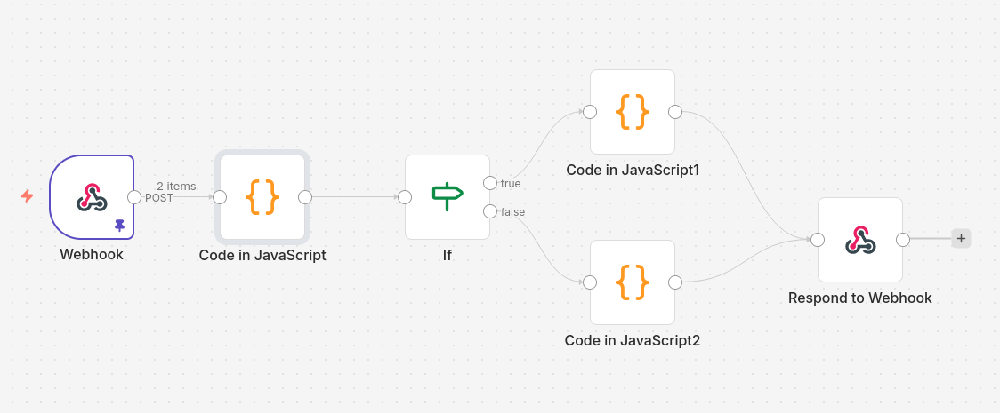

# Imixs-Connect Demo: Customer Validation with N8N

This tutorial shows how to integrate N8N into an Imixs workflow process using Imixs-Connect.
A user submits an offer in Imixs-Workflow. At the moment of submission, Imixs-Connect
automatically calls an N8N Webhook that validates the company name and enriches the
workitem with full customer data — without any custom Java code.



## The Use Case

```
Imixs-Workflow                    N8N
──────────────                    ──────────────────────────
User submits offer
  → customer.name = "Acme"
                      ──POST──►  Webhook Node
                                 │
                                 ├── IF: company known?
                                 │     YES → customer data
                                 │     NO  → empty response
                                 │
                                 └── Respond to Webhook
                      ◄─200 ───  XMLDocument response
  ← customer.id     = "CUST-4711"
  ← customer.name   = "Acme Corp GmbH"
  ← customer.status = "GOLD"
Workitem enriched with
customer data ✅
```

---

## Prerequisites

- Imixs-Workflow is running with `imixs-connect-core` deployed
- N8N is running and reachable at `http://localhost:5678`
- `imixs-connect.xml` is configured with the N8N endpoint (see [Setup](../README.md))

---

## Part 1: Build the N8N Workflow

Open N8N at `http://localhost:5678` and create a new workflow. You will add 5 nodes.

### Node 1 — Webhook

This node receives the incoming POST request from Imixs-Connect.

Add a **Webhook** node and configure it as follows:

| Field          | Value                             |
| -------------- | --------------------------------- |
| HTTP Method    | `POST`                            |
| Path           | `imixs-connect`                   |
| Authentication | `Header Auth`                     |
| Response Mode  | `Using "Respond to Webhook" node` |

For the **Header Auth** credential click **Create New Credential** and set:

| Field | Value                      |
| ----- | -------------------------- |
| Name  | `Authorization`            |
| Value | `Bearer your-secret-token` |

> **Important:** The `Name` field must be exactly `Authorization`. The `Value` field
> must contain the full header value including the `Bearer ` prefix. Imixs-Connect
> sends `Authorization: Bearer <apikey>` — so the credential Value and the apikey
> in `imixs-connect.xml` together must form the correct header:
>
> | imixs-connect.xml `<apikey>` | N8N Credential `Value`     |
> | ---------------------------- | -------------------------- |
> | `your-secret-token`          | `Bearer your-secret-token` |

You can verify the Webhook is reachable and the token works with curl:

```bash
curl -v -X POST http://localhost:5678/webhook-test/imixs-connect \
  -H "Authorization: Bearer your-secret-token" \
  -H "Content-Type: application/xml" \
  -d '<?xml version="1.0" encoding="UTF-8"?><document></document>'
```

A correct response returns `HTTP 200`.

**Publish the workflow** so that the productive webhook URL `/webhook/imixs-connect` becomes active. During development N8N also provides a
test URL at `/webhook-test/imixs-connect` — but only while the workflow editor
is open. For production always use the published URL.

---

### Node 2 — Code: Parse incoming XMLDocument

Imixs-Connect sends a standard Imixs XMLDocument as the POST body with
`Content-Type: application/xml`. N8N automatically parses incoming XML into a
JSON object using the `xml2js` library. This means the request body is **not**
available as a raw XML string but as a pre-parsed JSON structure.

The Imixs XMLDocument:

```xml
<document>
    <item name="customer.name">
        <value xsi:type="xs:string">Acme</value>
    </item>
</document>
```

Becomes this JSON structure in N8N:

```json
{
  "body": {
    "document": {
      "item": {
        "$": { "name": "customer.name" },
        "value": {
          "_": "Acme",
          "$": { "xsi:type": "xs:string" }
        }
      }
    }
  }
}
```

N8N uses the `xml2js` convention where XML **attributes** are stored under `$`
and XML **text content** is stored under `_`.

Add a **Code** node (JavaScript) that navigates this structure to extract the
item values:

```javascript
// N8N automatically parses the incoming XML into a JSON object (xml2js format).
// XML attributes are stored under '$', text content under '_'.
const body = $input.first().json.body;
const document = body.document;

// Helper: extract item value by name from the pre-parsed N8N XML structure
function getItemValue(doc, itemName) {
  const items = doc.item;
  // items can be a single object or an array if multiple items are present
  const itemArray = Array.isArray(items) ? items : [items];
  const found = itemArray.find((i) => i.$ && i.$.name === itemName);
  return found ? found.value._ : null;
}

const company = getItemValue(document, "customer.name");
return [{ json: { company } }];
```

> **Note:** If the Imixs XMLDocument contains multiple `<item>` elements, N8N
> represents them as an array. The helper function handles both cases — a single
> item object and an array of items.

---

### Node 3 — IF: Company known?

Add an **IF** node to check whether the company name is recognized.

| Field     | Value                 |
| --------- | --------------------- |
| Value 1   | `{{ $json.company }}` |
| Operation | `Contains`            |
| Value 2   | `Acme`                |

- **True branch** → customer is known, continue to Node 4a
- **False branch** → unknown customer, continue to Node 4b

---

### Node 4a — Code: Build customer response (True branch)

Add a **Code** node on the **True** branch to build the Imixs XMLDocument response:

```javascript
// Build a valid Imixs XMLDocument response with customer data.
// The item names must match the result-params configured in the BPMN event.
const xml = `<?xml version="1.0" encoding="UTF-8" standalone="yes"?>
<document xmlns:xsi="http://www.w3.org/2001/XMLSchema-instance"
          xmlns:xs="http://www.w3.org/2001/XMLSchema">
    <item name="customer.id">
        <value xsi:type="xs:string">CUST-4711</value>
    </item>
    <item name="customer.name">
        <value xsi:type="xs:string">Acme Corp GmbH</value>
    </item>
    <item name="customer.status">
        <value xsi:type="xs:string">GOLD</value>
    </item>
</document>`;

return [{ json: { xml } }];
```

---

### Node 4b — Code: Empty response (False branch)

Add a **Code** node on the **False** branch for unknown companies. Returning an
empty but valid XMLDocument is the correct way to signal "no data found" without
causing an error in Imixs-Connect:

```javascript
// Return an empty but valid Imixs XMLDocument.
// Imixs-Connect will receive HTTP 200 and simply find no items to merge.
const xml = `<?xml version="1.0" encoding="UTF-8" standalone="yes"?>
<document xmlns:xsi="http://www.w3.org/2001/XMLSchema-instance"
          xmlns:xs="http://www.w3.org/2001/XMLSchema">
</document>`;

return [{ json: { xml } }];
```

---

### Node 5 — Respond to Webhook

Add a **Respond to Webhook** node and connect both Code nodes (4a and 4b) to it.

| Field         | Value             |
| ------------- | ----------------- |
| Respond With  | `Text`            |
| Response Code | `200`             |
| Response Body | `{{ $json.xml }}` |

Add a custom response header so that Imixs-Connect can correctly parse the response:

| Header Name    | Header Value      |
| -------------- | ----------------- |
| `Content-Type` | `application/xml` |

> **Important:** `Respond With` must be set to `Text` — not `JSON` and not
> `First Incoming Item's Binary Data`. Any other setting causes N8N to wrap
> the XML string in a JSON envelope, which Imixs-Connect cannot unmarshal.
> The `Content-Type: application/xml` header is also required.

Your final N8N workflow looks like this:

```
[Webhook] → [Code: Parse XML] → [IF: company known?]
                                        │
                            ┌───────────┴───────────┐
                      TRUE  │                        │  FALSE
                            ▼                        ▼
                [Code: Customer data]   [Code: Empty response]
                            │                        │
                            └───────────┬────────────┘
                                        ▼
                              [Respond to Webhook]
```

---

## Part 2: Configure the BPMN Model

Open your BPMN process model in [Open-BPMN](https://www.imixs.org/doc/modelling/index.html)
and find the event where the offer is submitted (e.g. the "Submit" transition).

Add the signal adapter class `org.imixs.connect.workflow.ImixsConnectAdapter` and the
following Imixs-Connect configuration to the event's **Signal** definition:

```xml
<imixs-connect>
    <endpoint-id>N8N</endpoint-id>
    <debug>true</debug>
    <on-error>continue</on-error>
    <request-params>customer.name</request-params>
    <result-params>customer.id, customer.name, customer.status</result-params>
</imixs-connect>
```

| Parameter        | Description                                                                                        |
| ---------------- | -------------------------------------------------------------------------------------------------- |
| `endpoint-id`    | References the `N8N` entry in `imixs-connect.xml`                                                  |
| `debug`          | Logs request and response XML to the server log                                                    |
| `on-error`       | `continue` — if N8N is unreachable the workflow continues, error is stored in `adapter.error_code` |
| `request-params` | Items sent to N8N — only these fields are exposed                                                  |
| `result-params`  | Items read from the N8N response and merged into the workitem                                      |

### Optional: Add an Error Flow

If you want the workflow to react when N8N is unreachable, add a conditional
sequence flow on the Submit event:

```
"" != workitem.getItemValueString("adapter.error_code")
```

You can also check whether the customer lookup returned a result:

```
"" == workitem.getItemValueString("customer.id")
```

This allows you to route the process to a fallback state — for example a manual
review task — instead of silently continuing with missing customer data.

---

## Part 3: Test It

1. Open a workitem in your Imixs application
2. Enter `customer.name` = `Acme`
3. Submit the workitem
4. Check the server log for the `debug` output — you should see the full
   request and response XML
5. After processing, the workitem should contain:

| Item              | Value            |
| ----------------- | ---------------- |
| `customer.id`     | `CUST-4711`      |
| `customer.name`   | `Acme Corp GmbH` |
| `customer.status` | `GOLD`           |

In N8N you can inspect the full execution history under **Executions** — click
on any execution and then on a node in the workflow diagram to see its exact
input and output data.

---

## See Also

- [Imixs-Connect README](../README.md)
- [Implementing an Endpoint in Java](./endpoint-java.md)
- [Imixs XMLDocument Schema](https://www.imixs.org/doc/core/xml/index.html)
- [Imixs Adapter API](https://www.imixs.org/doc/core/adapter-api.html)
